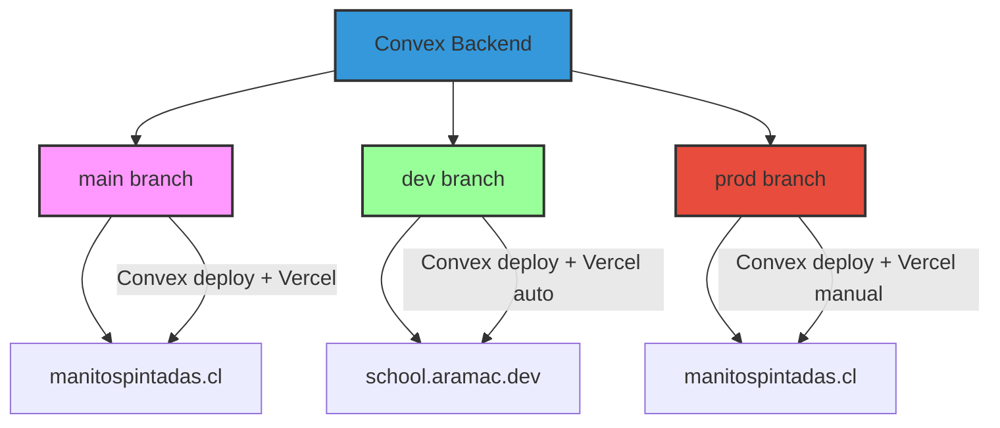
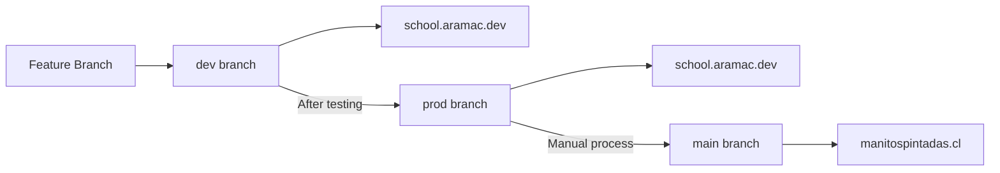

# 🚀 Deployment Guide - Manitos Pintadas School Management System

## 🏗️ Architecture Overview

The Manitos Pintadas project uses a **three-branch deployment strategy** with **Convex backend** and **Vercel frontend** to ensure safe, reliable deployments across different environments:



## 🌐 Environment Structure

| Environment         | Branch | URL                  | Purpose               | Auto-Deploy      | Backend            |
| ------------------- | ------ | -------------------- | --------------------- | ---------------- | ------------------ |
| **Main Production** | `main` | `manitospintadas.cl` | Primary school site   | ❌ Protected     | Convex Production  |
| **Development**     | `dev`  | `school.aramac.dev`  | Testing & Integration | ✅ Frequent Auto | Convex Development |
| **Production**      | `prod` | `manitospintadas.cl` | Live Production       | ⚠️ Rare Manual   | Convex Production  |

## 🚀 Deployment Workflows

### Development Deployment (dev → school.aramac.dev)

1. **Automatic Triggers**:
   - Push to `dev` branch
   - Merge PR into `dev` branch

2. **Deployment Pipeline**:

   ```bash
   Quality Checks → Unit Tests → E2E Tests → Convex Deploy → Vercel Build → Deploy → Health Check
   ```

3. **Configuration**:
   - Uses `vercel.dev.json`
   - Environment: `development`
   - Backend: Convex Development
   - Frontend: Vercel (school.aramac.dev)
   - Features: Debug mode enabled, comprehensive logging

### Production Deployment (prod → manitospintadas.cl)

1. **Manual Triggers** (RARE - Weekly at most):
   - Push to `prod` branch (requires explicit confirmation)
   - Requires `PRODUCTION_DEPLOYMENT_CONFIRMED=true` environment variable

2. **Deployment Pipeline**:

   ```bash
   Quality Checks → Full Test Suite → Security Scan → Convex Deploy → Manual Approval → Vercel Build → Deploy → Extensive Health Checks
   ```

3. **Configuration**:
   - Uses `vercel.prod.json`
   - Environment: `production`
   - Backend: Convex Production
   - Frontend: Vercel (manitospintadas.cl)
   - Features: Optimized builds, monitoring enabled, strict security headers

## 🔄 Convex Deployment Process

### Convex Backend Deployment

Convex functions are automatically deployed when you run the build process. The deployment process works as follows:

1. **Development Deployment**:

   ```bash
   # Convex functions deploy automatically with Vercel
   # No manual Convex deployment needed for development
   git push origin dev
   ```

2. **Production Deployment**:

   ```bash
   # Convex functions deploy with Vercel build
   # Production environment uses production Convex project
   PRODUCTION_DEPLOYMENT_CONFIRMED=true git push origin prod
   ```

### Convex Environment Management

Each deployment environment connects to a separate Convex project:

- **Development**: `school.aramac.dev` → Convex Development Project
- **Production**: `manitospintadas.cl` → Convex Production Project
- **Main**: `manitospintadas.cl` → Convex Production Project

### Environment Variables for Convex

```bash
# Required for all environments
NEXT_PUBLIC_CONVEX_URL=https://your-convex-project.convex.cloud

# Authentication (required)
NEXTAUTH_SECRET=your-32-character-secret-key
NEXTAUTH_URL=https://your-domain.com

# Optional integrations
GOOGLE_CLIENT_ID=your-google-oauth-client-id
GOOGLE_CLIENT_SECRET=your-google-oauth-client-secret
CLOUDINARY_CLOUD_NAME=your-cloudinary-name
CLOUDINARY_API_KEY=your-cloudinary-api-key
CLOUDINARY_API_SECRET=your-cloudinary-api-secret
```

## 🔧 Local Development Setup

### Quick Start

```bash
# Clone and setup
git clone [repository-url]
cd manitos-pintadas
npm install

# Initialize Convex backend
npx convex dev

# Setup environment variables
cp .env.example .env.local
# Edit .env.local with your Convex URL and other configuration

# Seed the database
npx convex dashboard
# In Functions tab: Run seed:seedDatabase with {}

# Start development
npm run dev
```

### Environment Configuration

1. **Initialize Convex**:

   ```bash
   npx convex dev
   ```

   This will:
   - Create/open your Convex project
   - Generate deployment URL (NEXT_PUBLIC_CONVEX_URL)
   - Create convex/\_generated/ types

2. **Configure environment variables**:

   ```bash
   # Copy example file
   cp .env.example .env.local
   ```

3. **Required variables**:
   - `NEXT_PUBLIC_CONVEX_URL` - Your Convex deployment URL
   - `NEXTAUTH_SECRET` - Random 32+ character string
   - `NEXTAUTH_URL` - Your domain URL (<http://localhost:3000> for dev)
   - OAuth credentials (Google, Facebook) - Optional
   - Cloudinary credentials - Optional

## 📋 Branch Management

### Creating Feature Branches

```bash
# Start from main
git checkout main
git pull origin main

# Create feature branch
git checkout -b feature/your-feature-name

# When ready, create PR to dev
git push -u origin feature/your-feature-name
# Create PR: feature/your-feature-name → dev
```

### Promoting Changes



1. **Feature → Development**:

   ```bash
   git checkout dev
   git pull origin dev
   git merge feature/your-feature
   git push origin dev
   # Automatically deploys to school.aramac.dev
   ```

2. **Development → Production**:

   ```bash
   git checkout prod
   git pull origin prod
   git merge dev
   git push origin prod
   # Automatically deploys to school.aramac.dev
   ```

3. **Production → Main** (Manual process):

   ```bash
   # Only after thorough testing in production
   git checkout main
   git pull origin main
   git merge prod
   git push origin main
   # Manual deployment to manitospintadas.cl
   ```

## 🧪 Testing Strategy

### Development Environment Testing

- **Unit Tests**: All tests must pass
- **E2E Tests**: Core workflows validated
- **Accessibility Tests**: WCAG compliance checks
- **Performance**: Basic lighthouse checks
- **Convex Functions**: Backend API testing
- **Real-time Features**: WebSocket connection testing

### Production Environment Testing

- **Full Test Suite**: All tests must pass
- **Security Scanning**: Vulnerability assessment
- **Performance Tests**: Comprehensive lighthouse audit
- **Load Testing**: Stress testing with realistic data
- **Health Checks**: Multi-layer validation
- **Convex Backend**: Database connectivity and function performance
- **Real-time Sync**: Data synchronization validation

## 🛡️ Deployment Safeguards

### Environment Validation

The deployment system includes multiple layers of validation to prevent accidental deployments:

1. **Branch Validation**: Ensures the correct branch deploys to the correct environment
2. **Domain Validation**: Verifies NEXT_PUBLIC_DOMAIN matches the target environment
3. **Convex URL Validation**: Ensures NEXT_PUBLIC_CONVEX_URL points to correct Convex environment
4. **Production Confirmation**: Requires explicit confirmation for production deployments
5. **Environment Variable Checks**: Validates all required environment variables are present

### Deployment Rules

- **Development**: `dev` branch → `school.aramac.dev` (Convex dev + Vercel auto)
- **Production**: `prod` branch → `manitospintadas.cl` (Convex prod + Vercel manual)
- **Main**: `main` branch → `manitospintadas.cl` (Convex prod + Vercel protected)

### Safeguard Alerts

- 🚨 Production deployments show clear warnings
- ✅ Development deployments are validated automatically
- 🔍 All deployments include health checks post-deployment
- 📊 Deployment notifications include target URLs

## 🔒 Security & Access Control

### Branch Protection Rules

```yaml
main:
  - Requires PR reviews (2 reviewers)
  - Requires status checks to pass
  - Requires up-to-date branches
  - No direct pushes allowed
  - Admin enforcement enabled

prod:
  - Requires PR reviews (1 reviewer)
  - Requires status checks to pass
  - Security scanning required
  - Deployment approval required

dev:
  - Requires status checks to pass
  - Allows fast-forward merges
  - Automatic deployments enabled
```

### Secret Management

Required secrets for GitHub Actions and Vercel:

```yaml
Development:
  - VERCEL_PROJECT_ID_DEV: Development project ID
  - CONVEX_DEPLOY_KEY_DEV: Convex development deployment key

Production:
  - VERCEL_PROJECT_ID_PROD: Production project ID
  - CONVEX_DEPLOY_KEY_PROD: Convex production deployment key

Shared:
  - VERCEL_TOKEN: Deployment token
  - VERCEL_ORG_ID: Organization ID
  - NEXTAUTH_SECRET: Authentication secret
  - NEXT_PUBLIC_CONVEX_URL: Convex deployment URL
```

## 📊 Monitoring & Observability

### Health Check Endpoints

```bash
# Basic health check (development)
curl https://school.aramac.dev/api/health

# Basic health check (production)
curl https://manitospintadas.cl/api/health

# Database connectivity
curl https://school.aramac.dev/api/health/database

# Authentication status
curl https://school.aramac.dev/api/health/auth
```

### Monitoring Features

- **Performance**: Vercel Analytics + Speed Insights
- **Error Tracking**: Built-in error boundaries
- **Health Monitoring**: Automated health checks
- **Convex Backend**: Database performance and function monitoring
- **Real-time**: WebSocket connection monitoring
- **Security**: Audit logging and authentication monitoring

## 🚨 Troubleshooting

### Common Issues

1. **Convex Deployment Failures**:

   ```bash
   # Check Convex deployment status
   npx convex dashboard

   # Verify Convex functions
   npx convex deploy --dry-run

   # Check build logs in GitHub Actions
   npm run build
   ```

2. **Convex Connection Issues**:

   ```bash
   # Verify Convex URL
   echo $NEXT_PUBLIC_CONVEX_URL

   # Test Convex connection
   npx convex dev --once

   # Check generated types
   ls convex/_generated/
   ```

3. **Environment Variable Issues**:

   ```bash
   # Check current status:
   npm run env:status

   # Verify Convex URL configuration
   npm run verify-env

   # Test authentication setup
   npx convex dashboard
   ```

### Convex-Specific Issues

1. **Convex Function Deployment Issues**:

   ```bash
   # Check Convex function logs
   npx convex dashboard
   # Navigate to "Functions" tab and check error logs

   # Test functions locally
   npx convex dev --once

   # Validate schema
   npx convex deploy --dry-run
   ```

2. **Real-time Connection Issues**:

   ```bash
   # Check WebSocket connections
   npx convex dashboard
   # Navigate to "Data" tab and monitor live queries

   # Verify Convex URL in client
   console.log(process.env.NEXT_PUBLIC_CONVEX_URL)
   ```

3. **Authentication with Convex Issues**:

   ```bash
   # Check NextAuth configuration
   npm run verify-env

   # Verify Convex auth adapter
   npx convex dashboard
   # Check "Auth" tab for user sessions
   ```

### Emergency Procedures

1. **Rollback Production**:

   ```bash
   # Revert to last known good commit
   git checkout prod
   git revert HEAD
   git push origin prod

   # If Convex issues, rollback Convex functions
   npx convex deploy --project your-prod-project
   ```

2. **Hotfix Process**:

   ```bash
   # Create hotfix from prod
   git checkout prod
   git checkout -b hotfix/critical-fix
   # Make fix, test locally
   git checkout prod
   git merge hotfix/critical-fix
   git push origin prod
   ```

## 📚 Additional Resources

### Scripts & Commands

```bash
# Environment management
npm run env:status              # Check environment status
npm run deploy:dev              # Deploy to development
npm run deploy:prod             # Deploy to production

# Quality assurance
npm run test:all                # Run complete test suite
npm run format                  # Format code with Prettier + ESLint
npm run type-check              # TypeScript validation

# Convex backend management
npx convex dev                  # Start Convex development server
npx convex deploy               # Deploy Convex functions
npx convex dashboard            # Open Convex dashboard
npm run convex:deploy           # Deploy Convex to production

# Database management
npm run create-admin            # Create admin user
npm run verify-env              # Verify environment configuration
```

### Configuration Files

- `convex.json` - Convex backend configuration
- `vercel.json` - Main Vercel configuration
- `vercel.dev.json` - Development environment settings
- `vercel.prod.json` - Production environment settings
- `vercel.main.json` - Main branch environment settings
- `.env.example` - Environment variables template
- `convex/schema.ts` - Database schema definition
- `convex/seed.ts` - Database seeding script

## 🎯 Best Practices

1. **Always test in development before production**
2. **Run the full test suite before merging to prod**
3. **Use meaningful commit messages**
4. **Keep environment-specific configurations separate**
5. **Monitor deployments and health checks**
6. **Document any manual configuration changes**
7. **Review security implications of all changes**

### Convex Resources

- **Convex Documentation**: <https://docs.convex.dev/>
- **Convex Dashboard**: <https://dashboard.convex.dev/>
- **Convex NextAuth Integration**: <https://stack.convex.dev/nextauth>
- **Convex Deployment Guide**: <https://docs.convex.dev/production/hosting/vercel>
- **Real-time Best Practices**: <https://docs.convex.dev/realtime>

### Project Documentation

- **Convex Migration Guide**: `CONVEX_MIGRATION.md`
- **Authentication Setup**: `CONVEX_SETUP_GUIDE.md`
- **Quick Start Guide**: `QUICK_START_CONVEX.md`

---

For questions or issues, check the Actions tab for deployment logs, Convex dashboard for backend issues, or contact the development team.
