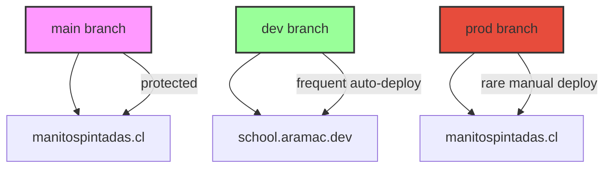

# 🚀 Deployment Guide - Manitos Pintadas School Management System

## 🏗️ Architecture Overview

The Manitos Pintadas project uses a **three-branch deployment strategy** to ensure safe, reliable deployments across different environments:



## 🌐 Environment Structure

| Environment | Branch | URL | Purpose | Auto-Deploy |
|-------------|--------|-----|---------|-------------|
| **Main Production** | `main` | `manitospintadas.cl` | Primary school site | ❌ Protected |
| **Development** | `dev` | `school.aramac.dev` | Testing & Integration | ✅ Frequent Auto |
| **Production** | `prod` | `manitospintadas.cl` | Live Production | ⚠️ Rare Manual |

## 🚀 Deployment Workflows

### Development Deployment (dev → school.aramac.dev)

1. **Automatic Triggers**:
   - Push to `dev` branch
   - Merge PR into `dev` branch

2. **Deployment Pipeline**:

   ```bash
   Quality Checks → Unit Tests → E2E Tests → Build → Deploy → Health Check
   ```

3. **Configuration**:
   - Uses `vercel.dev.json`
   - Environment: `development`
   - Database: Development PostgreSQL
   - Features: Debug mode enabled, comprehensive logging

### Production Deployment (prod → manitospintadas.cl)

1. **Manual Triggers** (RARE - Weekly at most):
   - Push to `prod` branch (requires explicit confirmation)
   - Requires `PRODUCTION_DEPLOYMENT_CONFIRMED=true` environment variable

2. **Deployment Pipeline**:

   ```bash
   Quality Checks → Full Test Suite → Security Scan → Manual Approval → Build → Deploy → Extensive Health Checks
   ```

3. **Configuration**:
   - Uses `vercel.prod.json`
   - Environment: `production`
   - Database: Production PostgreSQL
   - Features: Optimized builds, monitoring enabled, strict security headers

## 🔧 Local Development Setup

### Quick Start

```bash
# Clone and setup
git clone [repository-url]
cd manitos-pintadas
npm install

# Setup development environment
cp .env.dev.example .env.local
# Edit .env.local with your local configuration

# Setup database
npm run db:generate
npm run db:push
npm run db:seed

# Start development
npm run dev
```

### Environment Configuration

1. **Copy appropriate environment file**:

   ```bash
   # For local development
   cp .env.dev.example .env.local

   # For development branch
   cp .env.dev.example .env

   # For production branch
   cp .env.prod.example .env
   ```

2. **Configure required variables**:
   - `DATABASE_URL` - PostgreSQL connection string
   - `NEXTAUTH_SECRET` - Random 32+ character string
   - `NEXTAUTH_URL` - Your domain URL
   - OAuth credentials (Google, Facebook)
   - Cloudinary credentials

## 📋 Branch Management

### Creating Feature Branches

```bash
# Start from main
git checkout main
git pull origin main

# Create feature branch
git checkout -b feature/your-feature-name

# When ready, create PR to dev
git push -u origin feature/your-feature-name
# Create PR: feature/your-feature-name → dev
```

### Promoting Changes


1. **Feature → Development**:

   ```bash
   git checkout dev
   git pull origin dev
   git merge feature/your-feature
   git push origin dev
   # Automatically deploys to school.aramac.dev
   ```

2. **Development → Production**:

   ```bash
   git checkout prod
   git pull origin prod
   git merge dev
   git push origin prod
   # Automatically deploys to school.aramac.dev
   ```

3. **Production → Main** (Manual process):

   ```bash
   # Only after thorough testing in production
   git checkout main
   git pull origin main
   git merge prod
   git push origin main
   # Manual deployment to manitospintadas.cl
   ```

## 🧪 Testing Strategy

### Development Environment Testing

- **Unit Tests**: All 296 tests must pass
- **E2E Tests**: Core workflows validated
- **Accessibility Tests**: WCAG compliance checks
- **Performance**: Basic lighthouse checks

### Production Environment Testing

- **Full Test Suite**: All 495+ tests must pass
- **Security Scanning**: Vulnerability assessment
- **Performance Tests**: Comprehensive lighthouse audit
- **Load Testing**: Stress testing with realistic data
- **Health Checks**: Multi-layer validation

## 🛡️ Deployment Safeguards

### Environment Validation

The deployment system includes multiple layers of validation to prevent accidental deployments:

1. **Branch Validation**: Ensures the correct branch deploys to the correct environment
2. **Domain Validation**: Verifies NEXT_PUBLIC_DOMAIN matches the target environment
3. **Production Confirmation**: Requires explicit confirmation for production deployments
4. **Environment Variable Checks**: Validates all required environment variables are present

### Deployment Rules

- **Development**: `dev` branch → `school.aramac.dev` (automatic, frequent)
- **Production**: `prod` branch → `manitospintadas.cl` (manual, rare)
- **Main**: `main` branch → `manitospintadas.cl` (protected, manual only)

### Safeguard Alerts

- 🚨 Production deployments show clear warnings
- ✅ Development deployments are validated automatically
- 🔍 All deployments include health checks post-deployment
- 📊 Deployment notifications include target URLs

## 🔒 Security & Access Control

### Branch Protection Rules

```yaml
main:
  - Requires PR reviews (2 reviewers)
  - Requires status checks to pass
  - Requires up-to-date branches
  - No direct pushes allowed
  - Admin enforcement enabled

prod:
  - Requires PR reviews (1 reviewer)
  - Requires status checks to pass
  - Security scanning required
  - Deployment approval required

dev:
  - Requires status checks to pass
  - Allows fast-forward merges
  - Automatic deployments enabled
```

### Secret Management

Required secrets for GitHub Actions:

```yaml
Development:
  - DEV_DATABASE_URL: Development database connection
  - VERCEL_PROJECT_ID_DEV: Development project ID

Production:
  - PROD_DATABASE_URL: Production database connection
  - VERCEL_PROJECT_ID_PROD: Production project ID

Shared:
  - VERCEL_TOKEN: Deployment token
  - VERCEL_ORG_ID: Organization ID
```

## 📊 Monitoring & Observability

### Health Check Endpoints

```bash
# Basic health check (development)
curl https://school.aramac.dev/api/health

# Basic health check (production)
curl https://manitospintadas.cl/api/health

# Database connectivity
curl https://school.aramac.dev/api/health/database

# Authentication status
curl https://school.aramac.dev/api/health/auth
```

### Monitoring Features

- **Performance**: Vercel Analytics + Speed Insights
- **Error Tracking**: Built-in error boundaries
- **Health Monitoring**: Automated health checks
- **Database**: Connection monitoring
- **Security**: Audit logging

## 🚨 Troubleshooting

### Common Issues

1. **Deployment Failures**:

   ```bash
   # Check build logs in GitHub Actions
   # Verify environment variables
   # Run local build test:
   npm run build
   ```

2. **Database Connection Issues**:

   ```bash
   # Verify database URL format
   # Test connection:
   npm run verify-supabase
   ```

3. **Environment Variable Issues**:

   ```bash
   # Check current status:
   npm run env:status

   # Verify environment configuration
   npm run verify-env
   ```

### Emergency Procedures

1. **Rollback Production**:

   ```bash
   # Revert to last known good commit
   git checkout prod
   git revert HEAD
   git push origin prod
   ```

2. **Hotfix Process**:

   ```bash
   # Create hotfix from prod
   git checkout prod
   git checkout -b hotfix/critical-fix
   # Make fix, test locally
   git checkout prod
   git merge hotfix/critical-fix
   git push origin prod
   ```

## 📚 Additional Resources

### Scripts & Commands

```bash
# Environment management
npm run env:status              # Check environment status
npm run deploy:dev              # Deploy to development
npm run deploy:prod             # Deploy to production

# Quality assurance
npm run test:all                # Run complete test suite
npm run format                  # Format code with Prettier + ESLint
npm run type-check              # TypeScript validation

# Database management
npm run db:studio               # Open Prisma Studio
npm run db:migrate:deploy       # Deploy migrations
npm run create-admin            # Create admin user
```

### Configuration Files

- `vercel.json` - Main Vercel configuration
- `vercel.dev.json` - Development environment settings
- `vercel.prod.json` - Production environment settings
- `.env.dev.example` - Development environment template
- `.env.prod.example` - Production environment template
- `.github/workflows/deploy.yml` - Main deployment workflow
- `.github/workflows/pr-check.yml` - Pull request validation

## 🎯 Best Practices

1. **Always test in development before production**
2. **Run the full test suite before merging to prod**
3. **Use meaningful commit messages**
4. **Keep environment-specific configurations separate**
5. **Monitor deployments and health checks**
6. **Document any manual configuration changes**
7. **Review security implications of all changes**

---

For questions or issues, check the Actions tab for deployment logs or contact the development team.
